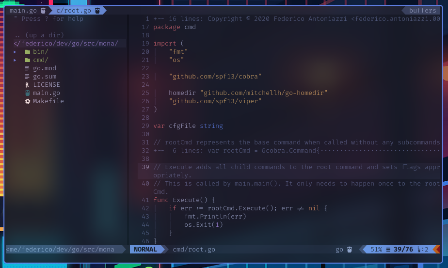

# My NeoVim setup

## Screenshot

## Languages
- Golang
- Markdown (+ Live preview)
- HTML/XTML/CSS

## Features per language
### Golang
I use two plugins for different scopes:
- [fatih/vim-go](https://github.com/fatih/vim-go) for commands like `:GoBuild` and `:GoTest`
- [neoclide/coc.nvim](https://github.com/neoclide/coc.nvim) with [coc-go](https://github.com/josa42/coc-go) for language server, completion and others features like importing missing modules on save

> **Note**: To make vim-go and coc-co work together, disable the usage of gopls for vim-go, do not set a languageserver in coc-settings.json manually and configure all these plugins to use the same gopls process. If any of these settings is not done, you'll have troubles with completion, errors and lots of resources used by more gopls instances.

### HTML, CSS, JavaScript (Also XML)
I don't use HTML, CSS and JS a lot but I found 3 useful plugins:
- [othree/xml.vim](https://github.com/othree/xml.vim) for managing *ML tags
- [mattn/emmet-vim](https://github.com/mattn/emmet-vim) for [emmet](https://www.emmet.io/) syntax
- [turbio/bracey.vim](https://github.com/turbio/bracey.vim) for a live preview of HTML, CSS and JS code.

In addition to plugins I use coc-html, coc-css and coc-tsserver.

### Markdown
For markdown I use only a plugin named [Markdown preview](https://github.com/iamcco/markdown-preview.nvim) which show a live preview of a markdown file in a browser.

## CoC Extensions
CoC.nvim is the easiest plugin I found and I like it for it's extensions but it's written in JavaScript so node and npm are required.
Here are the extensions I've installed:
- `coc-html`
- `coc-css`
- `coc-tsserver`
- `coc-go`
- `coc-snippets`
